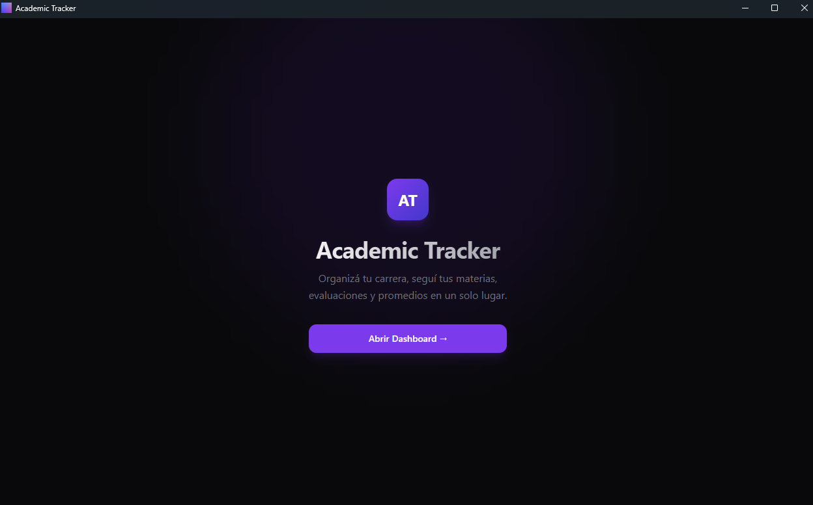
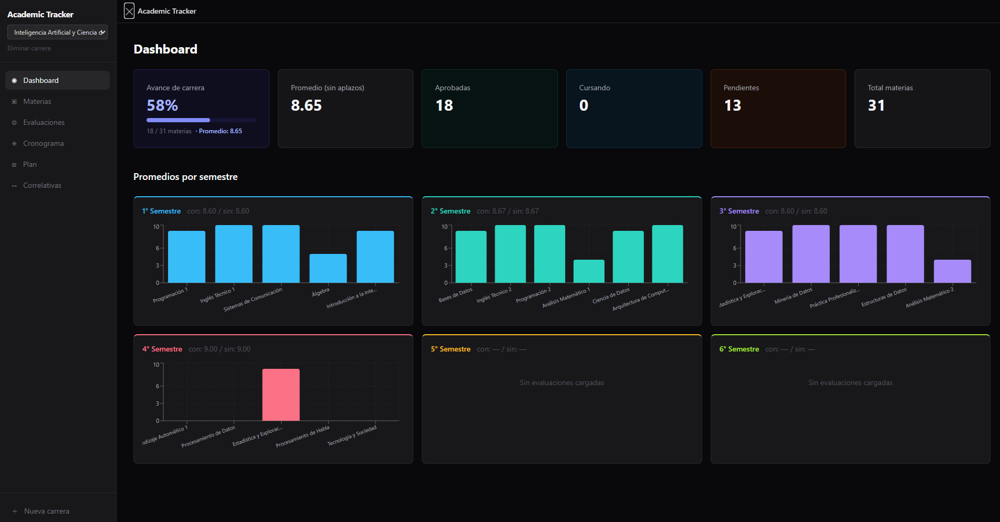

# Academic Tracker

Aplicación de escritorio para el seguimiento de carreras universitarias. Registrá tus materias, evaluaciones, asistencia y correlativas, y visualizá tu avance en un dashboard.

Desarrollada para la Lic. en Ciencia de Datos e IA (ISSD), pero funciona con cualquier carrera.

---

## Capturas

<p align="center">
  
  
</p>

---

## Características

- **Dashboard** con avance de carrera, promedios ponderados y próximas evaluaciones
- **Gestión de materias** con estados (cursando, aprobada, recursando, libre, pendiente)
- **Evaluaciones** con peso configurable, notas reales y simuladas
- **Cronograma semanal** de clases con vista de grilla
- **Plan de estudios** con visualización de correlativas interactivas
- **Múltiples carreras** con switch instantáneo entre ellas
- **Importación desde Excel** para cargar datos masivamente
- **Sin instalador** — ZIP y ejecutar

---

## Stack tecnológico

| Capa | Tecnología |
|---|---|
| Backend | Python 3.11 · FastAPI · SQLAlchemy 2.0 · SQLite · Pydantic v2 · Alembic |
| Frontend | React 19 · TypeScript · Vite · Tailwind CSS · TanStack Query · Radix UI |
| Desktop | PyInstaller (`--onedir`) · pywebview · WebView2 (Edge) |

---

## Uso como aplicación de escritorio

### Requisitos

**Solo Windows 10/11 de 64 bits.** No requiere Python ni Node instalados.

### Instalar

1. Descargá el ZIP del release
2. Descomprimí en cualquier carpeta
3. Ejecutá `AcademicTracker.exe`

La primera vez Windows puede mostrar un aviso de seguridad. Hacé clic en **"Más información" → "Ejecutar de todas formas"** (el ejecutable no tiene firma digital de pago, normal en apps personales).

### Dónde se guardan los datos

La base de datos se crea automáticamente en:

```
C:\Users\[tu usuario]\AppData\Roaming\AcademicTracker\academic_tracker.db
```

Los datos sobreviven a cualquier actualización del ejecutable porque viven fuera del bundle.

### Compartir la app

**Con tus datos:** comprimí la carpeta `AcademicTracker/` y la carpeta `data/` juntas, al mismo nivel, en un ZIP. El ejecutable detecta la carpeta `data/` automáticamente si está en el mismo directorio.

**Sin datos:** comprimí solo la carpeta `AcademicTracker/`. El usuario arranca con la app vacía y puede importar sus datos desde Excel.

---

## Desarrollo local

### Requisitos previos

- Python 3.11+
- Node.js 20+
- npm

```powershell
# Instalar dependencias (primera vez)
npm run install:all          # pip install -e . en backend + npm install en frontend

# Correr en modo desarrollo
npm run dev
# Backend disponible en http://localhost:8000 (Swagger en /docs)
# Frontend disponible en http://localhost:5173

# Correr tests del backend
npm test
```

### Build del ejecutable

```powershell
# Instalar dependencias extra (solo la primera vez)
pip install pywebview pyinstaller

# Generar el ejecutable (~1 minuto)
.\build_desktop.ps1
# Resultado: dist\AcademicTracker\AcademicTracker.exe
```

### Migraciones de base de datos

```powershell
cd backend
alembic upgrade head                             # aplicar migraciones pendientes
alembic revision --autogenerate -m "descripción" # crear nueva migración
```

---

## Estructura del proyecto

```
Academic_Tracker_ISSD/
├── backend/
│   ├── app/
│   │   ├── api/          ← endpoints REST por recurso
│   │   ├── models/       ← modelos SQLAlchemy 2.0
│   │   ├── schemas/      ← schemas Pydantic (validación)
│   │   ├── services/     ← lógica de negocio, analytics, importador
│   │   ├── config.py     ← rutas de datos según modo (dev vs exe)
│   │   └── main.py       ← app FastAPI
│   ├── alembic/          ← migraciones de base de datos
│   ├── tests/            ← pytest con SQLite en memoria
│   └── desktop.py        ← entry point del ejecutable (uvicorn + pywebview)
├── frontend/
│   └── src/
│       ├── pages/        ← Dashboard, Materias, Evaluaciones, Cronograma, Plan...
│       ├── hooks/        ← TanStack Query por recurso
│       ├── components/   ← UI (Radix UI + Tailwind)
│       └── lib/api.ts    ← cliente HTTP
├── docs/                 ← documentación completa del proyecto
├── assets/icon.ico
├── academic-tracker.spec ← configuración PyInstaller
├── build_desktop.ps1     ← script de build end-to-end
└── package.json          ← scripts raíz
```

---

## Documentación

La carpeta [`docs/`](docs/) tiene documentación completa organizada por tema:

| Documento | Descripción |
|---|---|
| [docs/README.md](docs/README.md) | Índice de la documentación con guía de lectura |
| [docs/arquitectura.md](docs/arquitectura.md) | Visión general: stack, estructura y flujo de datos |
| [docs/backend.md](docs/backend.md) | Backend: archivos Python, funciones y parámetros |
| [docs/frontend.md](docs/frontend.md) | Frontend: hooks, páginas y componentes |
| [docs/build_exe.md](docs/build_exe.md) | Cómo se genera el ejecutable Windows |
| [docs/guia_desarrollo.md](docs/guia_desarrollo.md) | Instalación, comandos de desarrollo y tests |
| [docs/base_de_datos.md](docs/base_de_datos.md) | Esquema completo de la base de datos |
| [docs/api_referencia.md](docs/api_referencia.md) | Referencia de todos los endpoints REST |
| [docs/schemas.md](docs/schemas.md) | Schemas Pydantic de validación |
| [docs/tests.md](docs/tests.md) | Cómo están organizados y cómo agregar tests |
| [docs/guia_usuario.md](docs/guia_usuario.md) | Guía de uso de la app para usuarios finales |
